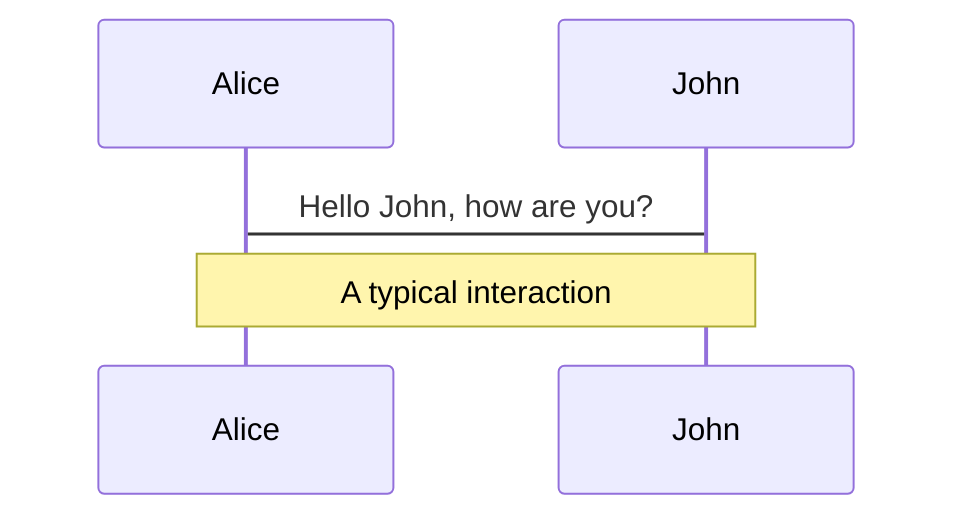
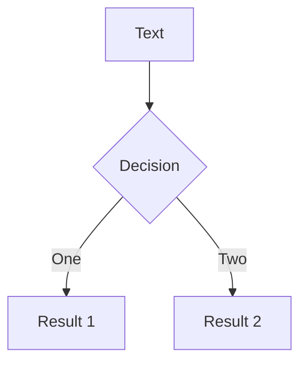
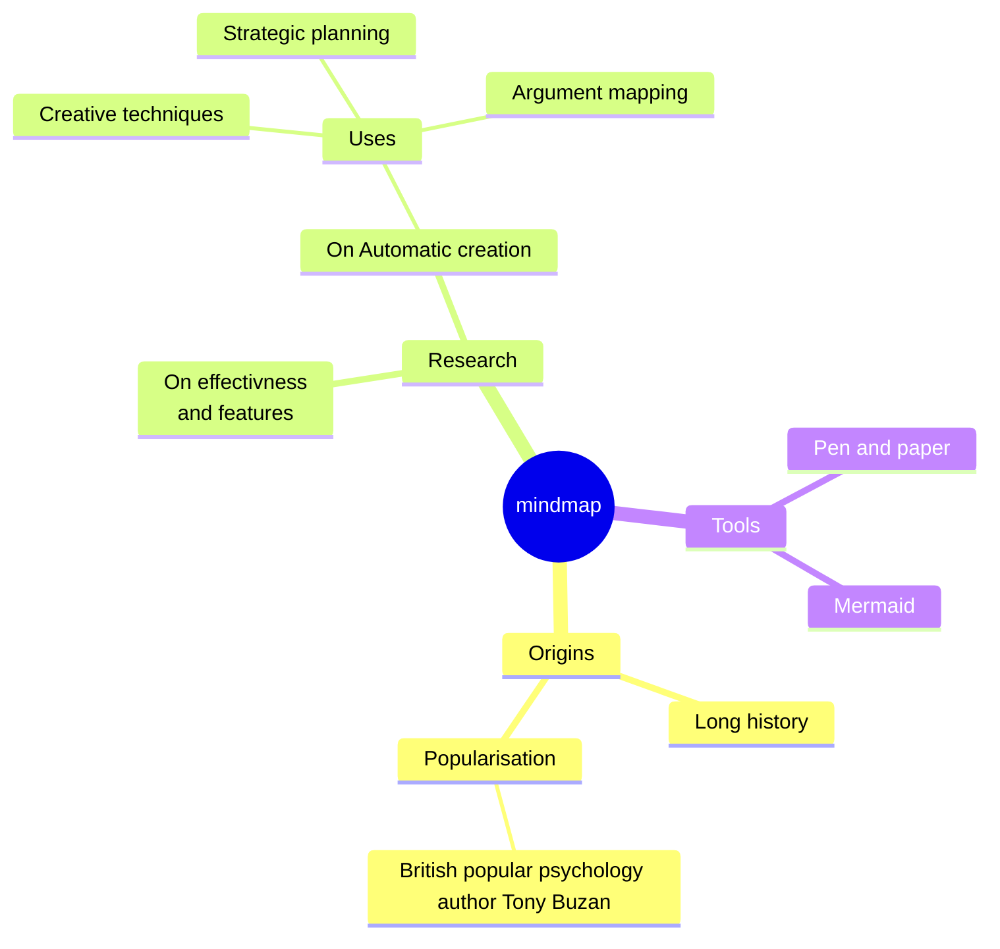
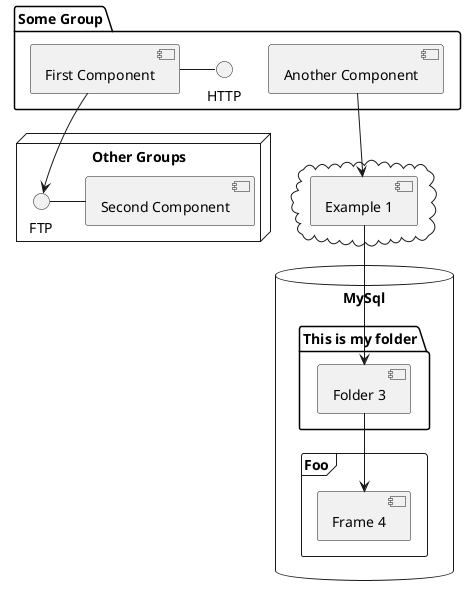

# Welcome to GitHub on the CLI

Presentation slides for Command Line Enthusiasts.

<div class="pt-12">
  <span @click="$slidev.nav.next" class="px-2 py-1 rounded cursor-pointer" hover="bg-white bg-opacity-10">
    Press Space for next page <carbon:arrow-right class="inline"/>
  </span>
</div>

<div class="abs-br m-6 flex gap-2">
  <button @click="$slidev.nav.openInEditor()" title="Open in Editor" class="text-xl slidev-icon-btn opacity-50 !border-none !hover:text-white">
    <carbon:edit />
  </button>
  <a href="https://github.com/mrolli/slides-github-on-the-cli" target="_blank" alt="Repo at GitHub"
    class="text-xl slidev-icon-btn opacity-50 !border-none !hover:text-white">
    <carbon-logo-github />
  </a>
</div>

---
hideInToc: true
---

# What is Github CLI (gh)?

<v-click>

gh brings GitHub to your terminal. Free and open source.

gh has come to stay as first-class building block in the GitHub universe
(130 releases in 3.5y!)


gh is written in Go and therefore available on any platform.

</v-click>

<v-click>

<br />

## Ok, but why should I use GitHub CLI?

</v-click>

<v-click>

> Goodbye, context switching between your terminal and your browser
for a seamless and mouse-less efficient developer experience.

* **Entire GitHub workflow:** Work with issues, pull request, checks, release and more on the CLI
* **Script, automate and customize** almost any action with builtin commands
* **GitHub API:** eventually also everything else available via the GitHub API
* **Enterprise-ready:** works with GitHub.com and GitHub Enterprise Server

<style>
blockquote {
  font-size: larger;
  margin: 2em 0em;
}
</style>

</v-click>

---
hideInToc: true
---

# Where can I get help on GitHub CLI?

gh has an excellent built-in help that follow common usage:

```bash
gh --help
gh COMMAND [SUBCOMMAND] --help
```

These built-in help texts are also available as a manual at https://cli.github.com/manual.

The official micro-website on Github CLI is at https://cli.github.com with a
short visual introduction to the tool and links to the **manual** and the **release
notes**. The latter are well maintained and a good read after every upgrade.

gh is open source. Find the repo at https://github.com/cli/cli

---
hideInToc: true
---

# Agenda

<Toc></Toc>

---
layout: section
---

# Getting Started

Installing and Configuring

---

# Installing the GitHub CLI binary

Follow the installation instructions at https://github.com/cli/cli#installation
for your platform.

For me on macOS using Homebrew:

```bash
brew install gh
```

<br />

<v-click>

**On macOS:**  
gh is available via Homebrew, MacPorts, Conda, Spack

**On Windows:**  
gh is available via WinGet, scoop, Chocolatey, Conda, and as downloadable MSI.

**On Linux:**  
gh is available either via official repos or as package downloads - see
[Installing gh on Linux and BSD](https://github.com/cli/cli/blob/trunk/docs/install_linux.md)

</v-click>

---

# Authenticating to GH and GHES

#### Login to github.com or our GHES

```bash
gh auth login
```


---
hideInToc: true
---

# Authentication (cont.)

#### Show current authentication status

```bash
gh auth status
```


---

# Manage Permission Scopes

As an example, we are going to add the read:project permission scope to the
GHES token:

```bash
gh auth refresh --scopes read:project --hostname github.unibe.ch
```

For more information on managing permission scopes, see gh auth refresh --help

<br />

# Setup the gh Credential Helper

Configure git to use GitHub CLI as the credential helper for all authenticated hosts

```bash
gh auth setup-git
```

This edits your git configuration file.

---
layout: section
---

# Working with Repositories

Creating, cloning, forking and all the rest

---
hideInToc: true
---

# Overview of repo commands

```
Work with GitHub repositories.

USAGE
  gh repo <command> [flags]

GENERAL COMMANDS
  create:      Create a new repository
  list:        List repositories owned by user or organization

TARGETED COMMANDS
  archive:     Archive a repository
  clone:       Clone a repository locally
  delete:      Delete a repository
  deploy-key:  Manage deploy keys in a repository
  edit:        Edit repository settings
  fork:        Create a fork of a repository
  rename:      Rename a repository
  set-default: Configure default repository for this directory
  sync:        Sync a repository
  unarchive:   Unarchive a repository
  view:        View a repository
```

---
hideInToc: true
---

# Listing Repositories

Show all repos my Repositories on github.com
```bash
gh repo list
```

Show all repos of IDSYS on github.com
```bash
gh repo list idsys-unibe-ch
```

List all repos of IDSYS on our GHES
```bash
GH_HOST=github.unibe.ch gh repo list idsys-unibe-ch
```

Having a hard-coded environment variable is not an ideal solution when you are
using both GitHub platforms, therefore an elegant alias might come in handy:

```bash
# Add this to your .bashrc or .zshrc
alias lgh="GH_HOST=github.unibe.ch gh"
```

---
hideInToc: true
---

# Forking and Cloning Repositories

#### Clone an existing repo of mine

```bash
➜ gh repo clone mrolli/testy
Cloning into 'testy'...
remote: Enumerating objects: 46, done.
remote: Counting objects: 100% (46/46), done.
remote: Compressing objects: 100% (29/29), done.
remote: Total 46 (delta 6), reused 46 (delta 6), pack-reused 0
Receiving objects: 100% (46/46), 11.43 KiB | 1.04 MiB/s, done.
Resolving deltas: 100% (6/6), done.
```

---
layout: section
---

# Working with Issues

Creating, commenting, properties, templates, ...

---
hideInToc: true
---

# Overview of issue commands

```
Work with GitHub issues.

USAGE
  gh issue <command> [flags]

GENERAL COMMANDS
  create:      Create a new issue
  list:        List issues in a repository
  status:      Show status of relevant issues

TARGETED COMMANDS
  close:       Close issue
  comment:     Add a comment to an issue
  delete:      Delete issue
  develop:     Manage linked branches for an issue
  edit:        Edit issues
  lock:        Lock issue conversation
  pin:         Pin a issue
  reopen:      Reopen issue
  transfer:    Transfer issue to another repository
  unlock:      Unlock issue conversation
  unpin:       Unpin a issue
  view:        View an issues
```

---
layout: section
---

# Working with Pull Requests

Creating, commenting, templates, merging ...

---
hideInToc: true
---

Common use cases around PRs


---
hideInToc: true
---

# On Merge Strategies

When working with PR, Github features three different merge methods:

* Merge pull request
* Squash and merge
* Rebase and merge

The allowed merge methods can be configured on a per repo basis.

> In a project, wisely choose one and stick to it! There is no right or false!

More information on this topic:

* [Official documentation on merge methods](https://docs.github.com/de/repositories/configuring-branches-and-merges-in-your-repository/configuring-pull-request-merges/about-merge-methods-on-github)
* [GitHub Merge straegies explained by examples](https://github.com/MarcBoissonneault/github-merge-strategies)

Also mentioned here shall be the [merge queue feature](https://docs.github.com/en/repositories/configuring-branches-and-merges-in-your-repository/configuring-pull-request-merges/managing-a-merge-queue) that GitHub offers.


---
layout: section
---

# Other Interesting Features

API, projects, releases, workflows, aliases, ruleset, extensions, ...

---
hideInToc: true
---

# Calling the GitHub REST API

```
function setup_snow_autolinkref {
  autolinkref=$(gh api --method GET \
    -H "Accept: application/vnd.github+json" \
    -H "X-GitHub-Api-Version: 2022-11-28" \
    "/repos/$1/autolinks" --jq '.[] | select(.key_prefix=="SNOW-")'
  )

  if [ -n "$autolinkref" ]; then
    success "Autolink reference for SNOW already setup."
    return 0
  fi

  gh api \
    --method POST \
    -H "Accept: application/vnd.github+json" \
    -H "X-GitHub-Api-Version: 2022-11-28" \
    "/repos/$1/autolinks" \
    -f key_prefix="SNOW-" \
   -f url_template="https://serviceportal.unibe.ch/text_search_exact_match.do?sysparm_search=<num>" \
   -F is_alphanumeric=true
}
```

See https://docs.github.com/en/rest

---
hideInToc: true
---

# Overview of project commands

```
Work with GitHub Projects. Note that the token you are using must have 'project'
scope, which is not set by default. You can verify your token scope by running
'gh auth status' and add the project scope by running 'gh auth refresh -s
project'.

USAGE
  gh project <command> [flags]

AVAILABLE COMMANDS
  close:       Close a project
  copy:        Copy a project
  create:      Create a project
  delete:      Delete a project
  edit:        Edit a project
  field-create: Create a field in a project
  field-delete: Delete a field in a project
  field-list:  List the fields in a project
  item-add:    Add a pull request or an issue to a project
  item-archive: Archive an item in a project
  item-create: Create a draft issue item in a project
  item-delete: Delete an item from a project by ID
  item-edit:   Edit an item in a project
  item-list:   List the items in a project
  list:        List the projects for an owner
  view:        View a project
```

---
hideInToc: true
---

---
transition: fade-out
hideInToc: true
---

# What is Slidev?

Slidev is a slides maker and presenter designed for developers, consist of the following features

- 📝 **Text-based** - focus on the content with Markdown, and then style them later
- 🎨 **Themable** - theme can be shared and used with npm packages
- 🧑‍💻 **Developer Friendly** - code highlighting, live coding with autocompletion
- 🤹 **Interactive** - embedding Vue components to enhance your expressions
- 🎥 **Recording** - built-in recording and camera view
- 📤 **Portable** - export into PDF, PNGs, or even a hostable SPA
- 🛠 **Hackable** - anything possible on a webpage

<br>
<br>

Read more about [Why Slidev?](https://sli.dev/guide/why)

<!--
You can have `style` tag in markdown to override the style for the current page.
Learn more: https://sli.dev/guide/syntax#embedded-styles
-->

<style>
h1 {
  background-color: #2B90B6;
  background-image: linear-gradient(45deg, #4EC5D4 10%, #146b8c 20%);
  background-size: 100%;
  -webkit-background-clip: text;
  -moz-background-clip: text;
  -webkit-text-fill-color: transparent;
  -moz-text-fill-color: transparent;
}
</style>

<!--
Here is another comment.
-->

---
layout: default
hideInToc: true
---

# Table of contents

```
<Toc minDepth="1" maxDepth="5"></Toc>
```

<Toc></Toc>

---
transition: slide-up

level: 2
hideInToc: true
---

# Navigation

Hover on the bottom-left corner to see the navigation's controls panel, [learn more](https://sli.dev/guide/navigation.html)

### Keyboard Shortcuts

|     |     |
| --- | --- |
| <kbd>right</kbd> / <kbd>space</kbd>| next animation or slide |
| <kbd>left</kbd>  / <kbd>shift</kbd><kbd>space</kbd> | previous animation or slide |
| <kbd>up</kbd> | previous slide |
| <kbd>down</kbd> | next slide |

<!-- https://sli.dev/guide/animations.html#click-animations -->

<p v-after class="absolute bottom-23 left-45 opacity-30 transform -rotate-10">Here!</p>

---
layout: image-right
image: https://source.unsplash.com/collection/94734566/1920x1080
hideInToc: true
---

# Code

Use code snippets and get the highlighting directly![^1]

```ts {all|2|1-6|9|all}
interface User {
  id: number
  firstName: string
  lastName: string
  role: string
}

function updateUser(id: number, update: User) {
  const user = getUser(id)
  const newUser = { ...user, ...update }
  saveUser(id, newUser)
}
```

<arrow v-click="3" x1="400" y1="420" x2="230" y2="330" color="#564" width="3" arrowSize="1" />

[^1]: [Learn More](https://sli.dev/guide/syntax.html#line-highlighting)

<style>
.footnotes-sep {
  @apply mt-20 opacity-10;
}
.footnotes {
  @apply text-sm opacity-75;
}
.footnote-backref {
  display: none;
}
</style>

---
hideInToc: true
---

# Components

<div grid="~ cols-2 gap-4">
<div>

You can use Vue components directly inside your slides.

We have provided a few built-in components like `<Tweet/>` and `<Youtube/>` that you can use directly. And adding your custom components is also super easy.

```html
<Counter :count="10" />
```

<!-- ./components/Counter.vue -->
<Counter :count="10" m="t-4" />

Check out [the guides](https://sli.dev/builtin/components.html) for more.

</div>
<div>

```html
<Tweet id="1390115482657726468" />
```

<Tweet id="1390115482657726468" scale="0.65" />

</div>
</div>

<!--
Presenter note with **bold**, *italic*, and ~~striked~~ text.

Also, HTML elements are valid:
<div class="flex w-full">
  <span style="flex-grow: 1;">Left content</span>
  <span>Right content</span>
</div>
-->


---
hideInToc: true
class: px-20
---

# Themes

Slidev comes with powerful theming support. Themes can provide styles, layouts, components, or even configurations for tools. Switching between themes by just **one edit** in your frontmatter:

<div grid="~ cols-2 gap-2" m="-t-2">

```yaml
---
theme: default
---
```

```yaml
---
theme: seriph
---
```


</div>

Read more about [How to use a theme](https://sli.dev/themes/use.html) and
check out the [Awesome Themes Gallery](https://sli.dev/themes/gallery.html).

---
preload: false
hideInToc: true
---

# Animations

Animations are powered by [@vueuse/motion](https://motion.vueuse.org/).

```html
<div
  v-motion
  :initial="{ x: -80 }"
  :enter="{ x: 0 }">
  Slidev
</div>
```

<div class="w-60 relative mt-6">
  <div class="relative w-40 h-40">
    
    
    
  </div>

  <div
    class="text-5xl absolute top-14 left-40 text-[#2B90B6] -z-1"
    v-motion
    :initial="{ x: -80, opacity: 0}"
    :enter="{ x: 0, opacity: 1, transition: { delay: 2000, duration: 1000 } }">
    Slidev
  </div>
</div>

<!-- vue script setup scripts can be directly used in markdown, and will only affects current page -->
<script setup lang="ts">
const final = {
  x: 0,
  y: 0,
  rotate: 0,
  scale: 1,
  transition: {
    type: 'spring',
    damping: 10,
    stiffness: 20,
    mass: 2
  }
}
</script>

<div
  v-motion
  :initial="{ x:35, y: 40, opacity: 0}"
  :enter="{ y: 0, opacity: 1, transition: { delay: 3500 } }">

[Learn More](https://sli.dev/guide/animations.html#motion)

</div>

---
hideInToc: true
---

# LaTeX

LaTeX is supported out-of-box powered by [KaTeX](https://katex.org/).

<br>

Inline $\sqrt{3x-1}+(1+x)^2$

Block
$$
\begin{array}{c}

\nabla \times \vec{\mathbf{B}} -\, \frac1c\, \frac{\partial\vec{\mathbf{E}}}{\partial t} &
= \frac{4\pi}{c}\vec{\mathbf{j}}    \nabla \cdot \vec{\mathbf{E}} & = 4 \pi \rho \\

\nabla \times \vec{\mathbf{E}}\, +\, \frac1c\, \frac{\partial\vec{\mathbf{B}}}{\partial t} & = \vec{\mathbf{0}} \\

\nabla \cdot \vec{\mathbf{B}} & = 0

\end{array}
$$

<br>

[Learn more](https://sli.dev/guide/syntax#latex)

---
hideInToc: true
---

# Diagrams

You can create diagrams / graphs from textual descriptions, directly in your Markdown.

<div class="grid grid-cols-3 gap-10 pt-4 -mb-6">









</div>

[Learn More](https://sli.dev/guide/syntax.html#diagrams)

---
src: ./pages/multiple-entries.md
hide: false
hideInToc: true
---

---
layout: center
class: text-center
hideInToc: true
---

# Learn More

[Documentations](https://sli.dev) · [GitHub](https://github.com/slidevjs/slidev) · [Showcases](https://sli.dev/showcases.html)
